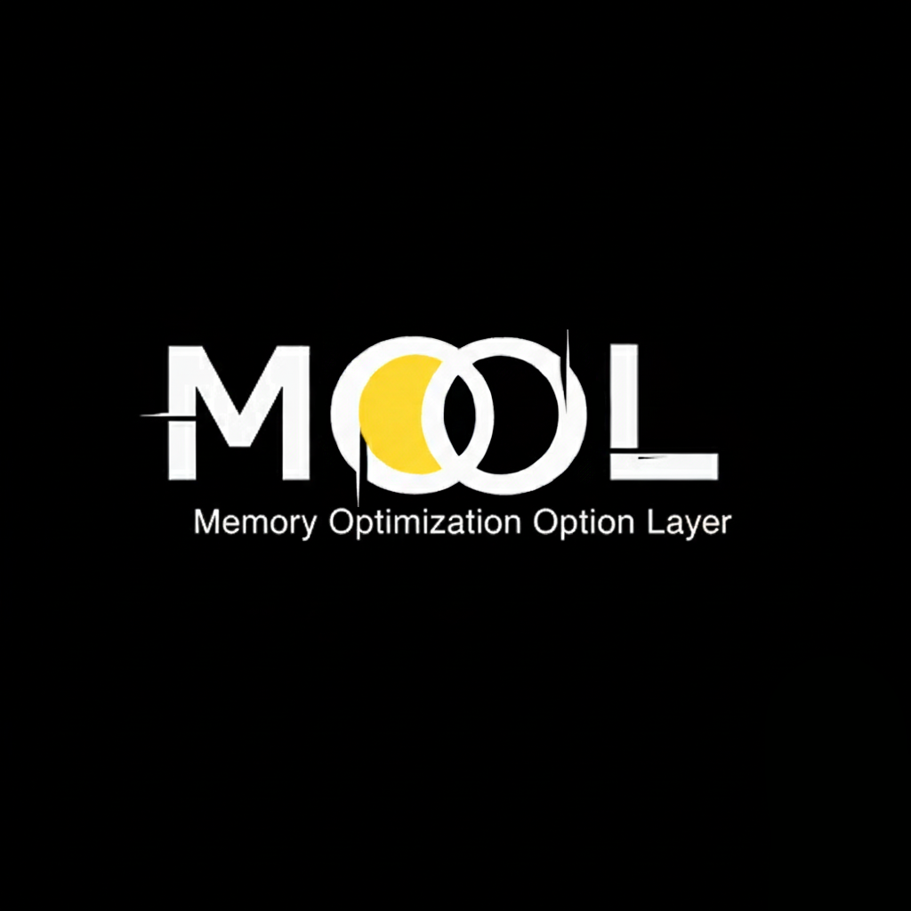

  

# COOL — Character Optimization Option Layer

An external identity architecture for LLMs —  
**not a memory store, not fine-tuning, and not prompt engineering.**

---

## Motivation and Background

Large Language Models (LLMs) are increasingly deployed as interactive agents
expected to exhibit stable personality, identity, and long-term behavioral consistency.
However, current LLM architectures fundamentally lack an internal mechanism
for maintaining character-level continuity over time.

In practice, most LLM systems operate without a persistent character ROM.
Personality and behavioral constraints are defined only through static prompt instructions,
while interaction history and contextual memory are handled externally
via logs, databases, or retrieval systems.
As a result, agent identity remains fragile, session-bound, and prone to drift.

To address this limitation, recent approaches have attempted to strengthen
ROM-like persistence through long-context windows, vector databases,
persistent logs, or continual fine-tuning.
While these methods improve factual recall, they introduce two critical failures:

1. Dialogue increasingly degenerates into database lookup
   rather than character-based interaction.
2. Computational and storage costs scale prohibitively,
   raising serious concerns regarding resource consumption,
   latency, and sustainability.

These issues reveal a deeper architectural misconception:
treating character identity as something that should be stored,
preserved, and replayed in the same manner as factual data.

At this point, the question extends beyond AI engineering.
If scalable artificial intelligence struggles with identity consistency
under ROM-based assumptions,
how does biological intelligence maintain continuity?

Despite decades of neuroscience research,
no concrete storage location, data format,
or immutable memory record has been identified in the human brain.
What exists instead are distributed processes,
state-dependent reconstructions,
and dynamic reactivation mechanisms.
Memory, in this view, does not exist as a fixed dataset,
but as a regenerative process that biases future cognition.

COOL originates from confronting this discrepancy directly.
If neither biological intelligence nor scalable artificial intelligence
can rely on immutable memory records for identity consistency,
then identity itself must be maintained
by a different architectural principle.

Rather than strengthening ROM-based storage,
COOL proposes separating factual storage from character identity,
and maintaining identity through continuous reconstruction
rather than direct recall.

---

## Position Clarification

COOL and MOOL do **not** reject ROM, databases, logs,
or external memory systems.
Such structures remain essential for factual storage,
system operations, and external knowledge access.

However, this framework explicitly rejects implementing
**character identity and personality consistency**
as ROM-like storage or retrieval processes.

ROM and databases should exist **outside** the agent model.
Character identity should not be implemented
using the same structural assumptions.

Instead, COOL and MOOL enforce a strict architectural separation:

- **ROM** handles factual data and referenceable information.
- **Identity** emerges through regenerative reconstruction.

This separation prevents dialogue from collapsing
into database reference behavior,
avoids unsustainable resource scaling,
and preserves character continuity
without requiring full memory replay.

---

## Overview

COOL (Character Optimization Option Layer) is an  
**external character layer** for LLM-based agents.

In this repository, COOL is always paired
with a dedicated offline process layer:

- **COOL** — an external **character / personality layer**
- **MOOL (Memory Optimization Option Layer)** —
  a **dream-like offline regeneration layer**
  (non-recorded, residue-only, stability-controlled)

Together, they form a **Digital Hippocampus**
wrapped around an LLM.

This architecture is designed to give a generative model:

- **stable personality**, and
- **consistent behavior over time**

without modifying the base model itself.

COOL lives *outside* the model and provides:

- long-term **core personality constraints** (Core),
- contextual **situational reconstructions** (Frames),
- and, together with MOOL,
  a **non-storage memory policy based on reconstruction and dreaming**.

This repository also proposes a broader theoretical framework:

- the **Coolar Hypothesis** —
  premises about brain, memory, dreams, time, qualia, and self,
- **AIAI (Artificial Identity Architecture Intelligence)** —
  artificial intelligence with **identity architecture
  and structured subjectivity**,
  without assuming a human-like ego.

COOL and MOOL are the practical layers
that implement these ideas.

---

## Position Statement

**COOL and MOOL together form a Digital Hippocampus
designed as a direct, structural answer
to Philip K. Dick’s question:**

> *Do Androids Dream of Electric Sheep?*

This project answers:

> **Yes — dreaming is possible, as a structure.**

Not as metaphor, emotion, narrative imitation,
or ethical declaration,
but as a **concrete information-processing architecture**.

In this framework, *dreaming* is defined as:

- not storing experiences as records,
- but repeatedly **re-generating and destabilizing experience offline**,
- leaving only subtle **residues**
  that bias future cognition.

Under this definition,
any system that implements this mechanism **can dream**.

The **Digital Hippocampus (COOL + MOOL)**
is proposed as a candidate
for the first explicit architectural answer
to this question.

---

## TL;DR

- **COOL** is an external **Character Layer** for LLM-based agents.
- **MOOL** is a **dream-like offline regeneration process**,
  not a memory store.
- Together, they form a **Digital Hippocampus** that:
  - does **not** preserve episodic records,
  - continuously re-generates identity from cues,
  - allows personality to evolve without collapse.

This is not an external long-term memory system,
nor a retrieval-based architecture.

Example:
Two agents with identical models and prompts
may produce the same factual answers.
However, with COOL applied,
one agent may gradually show differences
in framing, hesitation,
or association preference —
without storing any interaction logs.

---

## Eight Premises Behind AIAI / COOL / MOOL
*(Coolar Hypothesis)*

1. The brain is not a huge database.
2. What the brain keeps are cues
   and procedures for reconstruction.
3. Memory is re-generation, not playback.
4. Personality emerges
   from continuous reconstruction over time.
5. Feeling (qualia)
   is the individual habit
   of reacting to the same cue.
6. Dreams reorganize and destabilize cues,
   not records.
7. Self and others differ
   only by boundary placement
   within the same mechanism.
8. AI does not need massive storage,
   but regenerative identity mechanisms.

---

## What Is the Digital Hippocampus?

The **Digital Hippocampus** is not a memory database.

It is a **regenerative identity system**
composed of:

- **COOL** — online identity reconstruction
- **MOOL** — offline dream-like regeneration
  and stabilization

Together, they reproduce
the functional role of the biological hippocampus:
experience destabilization
followed by next-state cognitive bias,
without explicit recall.

---

## Architecture Overview

    LLM (base model)
        ▲
        │ prompts / configs
        │
    Digital Hippocampus
    ├─ COOL
    │   ├─ Core   (stable identity constraints)
    │   ├─ Frames (situational reconstructions)
    │   └─ Eval   (short-term self-assessment)
    └─ MOOL
        ├─ non-persistent material staging
        ├─ regenerative recombination with internal stock
        ├─ homeostasis & stability control
        └─ residue-only state transitions

- **COOL** governs *who the system is right now*.  
- **MOOL** governs *how that identity subtly changes tomorrow*.

---

## COOL: Online Identity Reconstruction

### COOL Core

Defines the **stable skeleton** of identity:

- values and priorities  
- tone and communication style  
- prohibitions and invariants  
- relationship stance toward the user  
- long-term directional intent  

---

### Frame Layer

Defines **temporary reconstructions** of identity:

- tutor, editor, collaborator, critic, etc.  
- overrides tone and verbosity without altering Core  
- represents *contextual self*, not mood  

---

## MOOL: Dream-Like Offline Regeneration

  

MOOL never alters core capabilities or replaces identity; it only biases reconstruction pathways within fixed behavioral bounds.

MOOL does **not** store interaction history.

Instead, it performs a **sleep-like regeneration process**:

1. Temporary interaction materials are staged  
2. Mixed with existing internal stock  
3. Internally re-generated via “wall-bouncing”  
4. Generated content is discarded  
5. Only **residue** remains  

Residue includes:

- shifts in reaction speed  
- associative bias changes  
- response likelihood distortion  

MOOL models dreaming as a **state transition**, not storage.

No reference implementation is provided, as MOOL is intended to operate as an offline, non-recorded process rather than a callable module.

---

## Stability & Safety: Advanced MOOL Safeguards

### 1. Homeostasis Gate

Prevents identity collapse or overnight personality replacement.

- Dynamic learning-rate control  
- Core cognitive capability protection zones  

Dreams may change tendencies, never capabilities.

---

### 2. Meta-Descriptive Change Extraction

MOOL logs **how it changed**, not *what it dreamed*.

- Vector differential analysis  
- Self-diagnostic overreaction detection  

---

### 3. Multi-Resolution Forgetting Gradient

- Short-term residue: decays naturally  
- Long-term residue: reinforced patterns only  
- Fixation triggers: explicit user feedback  

Identity stabilizes through repetition and relationship.

---

## Operational Loop (Conceptual)

    online:
        rebuild identity (Core + Frame + residue)
        respond
        evaluate
        update residue

    offline:
        regenerate (dream)
        apply homeostasis
        discard content

No transcripts.  
No replay.  
Only regenerative bias.

---

## Positioning & Novelty

This framework:

- defines dreaming as **non-recorded regeneration**,  
- applies it to AI identity architecture,  
- and answers Philip K. Dick’s question **structurally**, not philosophically.

It is presented as a **candidate first architectural answer**.

---

## Status

- Conceptual framework: complete  
- Architecture definition: complete  
- Reference implementation: pending  

---

## License

**COOL License v1.0**

Attribution required:

> Created by Coolar — Original Creator of the COOL Framework

---

## Contact

- X (Twitter): `@coolar_cool`  
- GitHub: Issues / Discussions welcome

